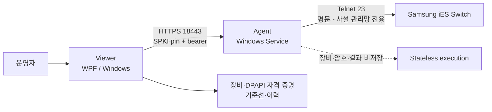

# Samsung iES Switch Watch

[](https://github.com/sebia1993/samsung-ies-switch-watch/actions/workflows/windows-ci.yml)

Samsung iES 스위치의 반복 점검을 한 화면에서 수행하고 변화를 추적하는 Windows 운영 도구입니다. 네트워크 장비를 모르는 독자에게는 **“여러 설비의 상태를 안전하게 원격 확인하는 대시보드”**로 이해하면 됩니다.

현재 공개 버전은 **`v0.13.0-poc`**입니다. 이 저장소는 실제 회사망 성과를 꾸며내지 않습니다. 공개된 검증 결과는 합성 Telnet 서버, 비식별 fixture, Windows CI와 패키지 smoke에 한정되며 실제 모델·펌웨어 검증은 별도 항목으로 표시합니다.

## 채용 검토를 위한 읽기 순서

1. 아래 시스템 구조에서 **Viewer의 운영 상태와 Agent의 장비 접근 권한**을 구분합니다.
2. [설계 사례와 코드·테스트 근거](docs/PORTFOLIO_CASE_STUDY_KO.md)에서 명령 검증, 제한적 재연결, 감시 queue와 설치 복구를 검토합니다.
3. 같은 문서의 장비 없는 재현 절차와 [Windows CI 실행](https://github.com/sebia1993/samsung-ies-switch-watch/actions/workflows/windows-ci.yml)을 확인합니다. 실제 Samsung 모델·펌웨어 검증은 별도입니다.

## 프로젝트가 해결하는 문제

운영자는 여러 스위치에 반복 로그인해 같은 상태 명령을 실행하고 이전 결과와 비교해야 합니다. 이 프로젝트는 그 과정을 다음처럼 분리했습니다.

- **Viewer**는 장비 목록, 암호화된 자격 증명, 점검 일정과 이력을 관리합니다.
- **Agent**는 별도 Windows 서비스로 동작하며 요청받은 읽기 전용 점검만 실행합니다.
- 스위치에는 한 줄 `show` 명령만 전송하고 설정 변경 명령은 양쪽에서 차단합니다.
- Agent와 Viewer는 수동 페어링을 거쳐 서로를 확인합니다.
- 설치·업데이트는 중간 실패 시 기존 버전을 복구할 수 있도록 트랜잭션으로 처리합니다.

정량적인 시간 절감이나 장애 감소 수치는 실제 현장 측정 전에는 주장하지 않습니다. 대신 코드와 CI가 재현할 수 있는 **보안 경계, 실패 처리, 배포 무결성**을 성과로 제시합니다.

## 한눈에 보는 결과

| 관점 | 구현 결과 |
|---|---|
| 반복 업무 | 여러 장비의 조회·감시 흐름을 하나의 WPF Viewer로 통합 |
| 책임 분리 | 운영 데이터는 Viewer, 네트워크 실행은 stateless Agent가 담당 |
| 장비 안전 | 줄바꿈·구분자·설정 명령을 차단하고 최대 8개 조회 명령만 허용 |
| 원격 인증 | 256-bit bearer token과 Agent 인증서 공개키 pin을 하나의 수동 페어링 코드로 전달 |
| 로컬 비밀 보호 | Agent token은 DPAPI LocalMachine, Viewer token은 DPAPI CurrentUser로 보호 |
| 전송 신뢰 | 자체 서명 인증서라도 사전에 페어링한 SPKI SHA-256과 고정 시간 비교 |
| API 전환 | 인증이 필수인 API v5만 실행하고 v4는 HTTP 426으로 명시적 차단 |
| 장애 대응 | bounded 감시 queue, worker 2개, 장비별 circuit breaker, stale 응답 거부, 제한적 재연결 |
| 운영 진단 | 비밀·IP tag 없이 queue/worker/Telnet 상태를 로컬 .NET metrics로 노출 |
| 배포 품질 | lock file, 취약 패키지 검사, SBOM, SHA-256, 다운로드 후 EXE smoke |
| 증거 구분 | 합성/CI 검증과 실제 장비·GPO·EDR 현장 검증을 명확히 분리 |

## 시스템 구조



### 페어링 흐름

1. Agent가 최초 실행 때 HTTPS 인증서와 32-byte API token을 생성합니다.
2. 인증서와 token은 Agent PC의 DPAPI LocalMachine으로 보호해 유지합니다.
3. 관리자용 Setup이 `SSW1.<base64url(SPKI 32 bytes || token 32 bytes)>` 코드를 표시합니다.
4. 운영자가 Viewer 연결 설정에 코드를 한 번 입력합니다.
5. Viewer는 공개키 pin과 DPAPI CurrentUser로 보호한 token만 저장합니다.
6. 이후 모든 `/api/v5/*` 요청은 인증서 pin과 bearer 인증을 모두 통과해야 합니다.

페어링 코드는 API token을 포함하는 비밀입니다. 명령행 인수나 로그로 출력하지 않으며 Setup 화면에서 사용자가 명시적으로 표시·복사할 때만 다룹니다.

## 주요 화면

화면은 실제 WPF UI를 문서용 IP와 합성 데이터로 렌더링한 예시입니다.


## 기술적 핵심

### 1. 읽기 전용 실행 경계

Viewer와 Agent가 각각 명령을 검증합니다.

```text
한 줄 + show로 시작 + 128자 이하
+ CR/LF와 제어문자 없음
+ ; & | 같은 연결 문법 없음
+ configure / shutdown / reload / write 등 변경 흐름 없음
```

인증·enable 실패와 명령 timeout은 무조건 재시도하지 않습니다. 장비가 명령 실행 도중 연결을 끊은 경우에만 새 세션을 최대 한 번 만들고 완료되지 않은 명령만 다시 처리합니다.

### 2. 인증과 인증서 고정

- `/health/live`, `/health/ready`를 포함한 모든 Agent 경로는 32-byte bearer token이 필요합니다.
- health 응답은 인증 뒤에도 생존·버전·프로토콜에 필요한 최소 정보만 반환합니다.
- token 비교와 SPKI pin 비교는 `CryptographicOperations.FixedTimeEquals`를 사용합니다.
- 인증서 유효기간과 TLS Server Authentication EKU도 확인합니다.
- pin 불일치, token 손상·누락, API 세대 불일치는 자동 수락하거나 구형 API로 fallback하지 않습니다.
- 인증 정보, 장비 암호, 명령 원문과 출력은 진단 로그에 기록하지 않습니다.

### 3. 상태와 장애 처리

- 요청마다 별도 Telnet 세션을 만들고 종료합니다.
- 로그인, enable, 명령 수집에 독립적인 시간·바이트 예산을 둡니다.
- 장비 한 대 동시 세션 1개, Agent 전체 동시 실행과 요청 빈도를 제한합니다.
- Viewer 감시는 `PeriodicTimer`와 최대 256개 bounded queue, worker 2개를 사용하며 같은 장비의 중복 수집을 합칩니다.
- 연결 계층 장애가 3회 연속 발생한 장비는 30초 동안 회로를 열고, 이후 한 번의 half-open 수집으로 복구 여부를 확인합니다.
- Agent를 바꾼 뒤 늦게 도착한 이전 응답은 client generation으로 식별해 폐기합니다.
- 이벤트 queue는 제한된 크기에서 같은 변화를 합쳐 UI 정지를 방지합니다.

### 4. 관리망·민감 조회 경계

- Agent target은 IPv4, RFC1918, TCP/23 조건과 함께 `AllowedTargetCidrs`에 포함되어야 합니다.
- `AllowedTargetCidrs`가 비어 있으면 업그레이드 호환을 위해 기존 RFC1918 세 범위를 사용합니다. Agent Setup은 검증된 기존 범위를 복원하고 최대 32개의 canonical 사설 CIDR을 입력받아 관리 VLAN을 더 좁힙니다.
- `show running-config`, `show startup-config`는 민감 조회로 분류하며 Viewer와 Agent 양쪽에서 기본 차단합니다. 연결 설정에서 명시적으로 허용한 요청만 실행합니다.
- 명령 원문·출력, 자격 증명, token, 인증서 개인키와 실제 장비 IP는 metrics tag나 진단 로그에 넣지 않습니다.

### 5. 배포·공급망 검증

- NuGet `packages.lock.json`과 `packages.win-x64.lock.json`을 고정합니다.
- CI에서 전이 의존성을 포함한 취약 패키지를 검사합니다.
- Agent/Viewer를 self-contained Windows x64 ZIP으로 만듭니다.
- SPDX와 CycloneDX SBOM, build manifest, SHA-256을 생성합니다.
- CI artifact를 다시 다운로드해 package contract와 실제 EXE smoke를 재검증합니다.
- 공개 ZIP은 GitHub build provenance attestation과 immutable release 절차를 사용합니다.

## 지원 범위

코드에 등록된 모델은 다음 세 가지입니다.

- IES4224GP
- IES4028XP
- IES4226XP

등록 모델이라는 뜻은 fixture 기반 파서가 해당 모델을 인식한다는 의미입니다. 모든 실제 펌웨어에서 검증됐다는 뜻은 아닙니다.

## 설치와 사용

공식 Release에서 다음 두 파일을 받아 같은 버전으로 사용합니다.

```text
SamsungSwitchWatch-Agent-0.13.0-poc-win-x64.zip
SamsungSwitchWatch-Viewer-0.13.0-poc-win-x64.zip
```

1. Agent PC에서 Agent ZIP을 풀고 `SamsungSwitchWatch.Agent.Setup.exe`를 관리자 권한으로 실행합니다.
2. 설치 후 `페어링 코드 보기`에서 코드를 확인합니다.
3. 운영자 PC에서 Viewer ZIP의 `SamsungSwitchWatch.Viewer.Setup.exe`를 실행합니다.
4. Viewer 연결 설정에 Agent 주소와 페어링 코드를 입력합니다.
5. 연결 확인 후 장비를 등록하고 로그인 시험을 수행합니다.

이전 버전에서 업데이트하면 기존 장비·감시 이력은 보존하지만 기존의 무인증 연결은 신뢰하지 않습니다. Agent와 Viewer를 함께 업데이트하고 반드시 새 코드로 다시 페어링해야 합니다. 상세 절차는 [설치·마이그레이션 가이드](docs/INSTALL_KO.md)에 있습니다.

## 검증

```powershell
dotnet restore SamsungSwitchWatch.sln --locked-mode
dotnet build SamsungSwitchWatch.sln -c Release --no-restore
dotnet test SamsungSwitchWatch.sln -c Release --no-build
.\scripts\validate.ps1 -Configuration Release
```

릴리스 패키지 생성:

```powershell
.\scripts\build-release.ps1 -Version 0.13.0-poc
```

자동 검증은 합성 데이터만 사용합니다. 실제 사내 스위치, 주소, 계정, MAC, 원문 출력을 공개 fixture나 CI에 넣지 않습니다. 자세한 범위는 [검증 보고서](docs/VALIDATION_REPORT.md)를 참고하십시오.

Windows에서 실제 장비 없이 deterministic stability workload 실행:

```powershell
dotnet run --project .\tools\SamsungSwitchWatch.StabilityHarness -c Release -- --profile quick --devices 100 --seed 372811
```

`smoke` 5분, `quick` 15분, `standard` 1시간, `extended` 8시간, `manual` 24시간 profile을 제공합니다. 긴 profile은 기본 CI에서 자동 실행하지 않습니다.

## 분명한 한계

- **Agent→Switch는 Telnet/TCP 23 평문입니다.** 사용자 이름, 암호와 장비 출력이 암호화되지 않으므로 격리된 사설 관리망에서만 사용해야 합니다.
- 이 도구는 설정 변경 자동화, 인터넷 공개 API, 무중단 24시간 NMS를 목표로 하지 않습니다.
- POC ZIP은 코드 서명되지 않을 수 있으므로 조직의 SmartScreen·EDR·AppLocker 정책 승인이 필요합니다.
- 실제 Windows Service 복구, GPO/방화벽, 백신 잠금과 모델별 펌웨어 차이는 현장에서 별도 검증해야 합니다.

## 문서

- [현재 릴리스 노트](docs/RELEASE_NOTES_0.13.0_POC_KO.md)
- [설치·재페어링](docs/INSTALL_KO.md)
- [보안 설계](docs/SECURITY.md)
- [아키텍처](docs/ARCHITECTURE.md)
- [검증 보고서](docs/VALIDATION_REPORT.md)
- [한계와 운영 전제](docs/LIMITATIONS_KO.md)
- [보안 제보 정책](.github/SECURITY.md)
- [개발 가이드](DEVELOPMENT.md)

## 라이선스

MIT License. 자세한 내용은 [LICENSE](LICENSE)를 확인하십시오.
