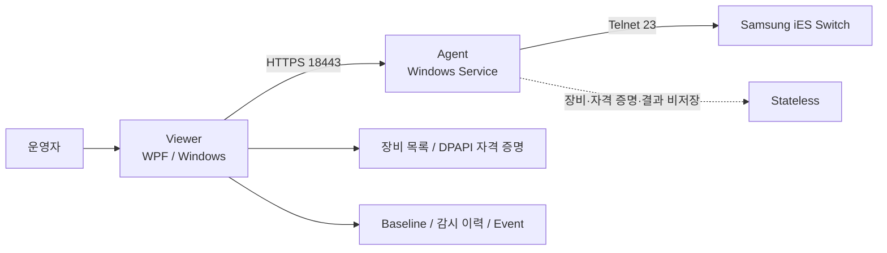

# Samsung Switch Watch — Samsung iES 원격 점검·변경 감시

[](https://github.com/sebia1993/samsung_switch_check/actions/workflows/windows-ci.yml)

**Samsung iES 스위치를 운영자 PC에서 안전하게 조회하고, 반복 점검과 상태 변화를 기록하기 위한 Windows 기반 읽기 전용 네트워크 운영 도구입니다.**

Viewer가 장비·자격 증명·감시 기준을 소유하고, 별도 Windows Service Agent가 HTTPS 요청을 받아 스위치와 짧은 Telnet 세션을 생성합니다. Agent는 장비 정보와 명령 결과를 보관하지 않으며, 수동 명령은 한 줄의 `show` 명령만 허용합니다.

현재 공개 버전은 **`v0.11.11-poc`**입니다. 자동 테스트와 Windows 패키지 검증은 수행하지만, Samsung iES 모델별 실제 펌웨어 동작은 현장 검증 결과와 분리해 기록합니다.

> 문서·테스트·화면 예시는 문서용 IP와 합성 데이터만 사용합니다. 실제 운영망 주소, 계정, MAC, 장비 출력은 공개 저장소에 포함하지 않습니다.

## 한눈에 보기

| 항목 | 내용 |
|---|---|
| 목적 | Samsung iES 스위치 원격 조회·주기 점검·변화 감시 |
| 운영 구조 | Viewer → HTTPS Agent → Telnet Switch |
| Agent | 창 없는 Windows Service, stateless 실행 중계 |
| Viewer | 장비 목록, DPAPI 자격 증명, 감시 기준·이력 소유 |
| 스위치 연결 | Telnet TCP/23 |
| Viewer→Agent | HTTPS TCP/18443 |
| 수동 명령 | 한 줄 `show` 명령만 허용 |
| 감시 요청 | 검증된 조회 명령 최대 8개 |
| 모델 식별 | 로그인 후 `show version`, 정확히 한 모델만 식별 |
| 지원 대상으로 등록된 모델 | IES4224GP, IES4028XP, IES4226XP |
| 재시도 | 연결 단절 시 미완료 명령만 최대 1회 재연결 |
| 자격 증명 | Viewer의 Windows DPAPI CurrentUser 보호 |
| 원문 출력 | 수동 결과는 Viewer 메모리에서만 사용, 저장·내보내기 금지 |
| 배포 | Agent/Viewer 각각 Windows x64 self-contained ZIP |
| 현재 단계 | POC — Windows 자동검증 완료, 모델별 현장 검증은 별도 |

## 해결하려 한 운영 문제

스위치 여러 대를 반복 점검할 때 운영자는 장비별로 접속해 동일한 `show` 명령을 실행하고, 이전 결과와 현재 결과를 비교해야 합니다. 특히 Telnet 기반 장비가 남아 있는 환경에서는 운영 PC마다 접속 경로와 자격 증명을 직접 다루게 되는 것도 부담입니다.

이 프로젝트는 다음 문제를 분리해서 다룹니다.

- 장비마다 반복 로그인하고 동일한 조회 명령을 수동 실행하는 작업
- 여러 장비의 상태를 일정 주기로 확인하고 변화를 놓치지 않는 문제
- 운영자 PC가 스위치 Telnet 세션을 직접 대량으로 관리하는 구조
- 장비 모델을 사용자가 잘못 선택해 잘못된 명령 세트를 적용하는 위험
- 네트워크 단절을 무조건 재시도해 같은 작업을 중복 실행하는 위험
- 자격 증명·장비 원문·운영 이력이 Agent에 남는 문제
- 설치/업데이트 실패가 정상 동작 중인 Agent까지 손상시키는 위험

핵심 방향은 **“Viewer가 운영 상태를 소유하고, Agent는 제한된 조회 실행만 중계한다”**입니다.

## 아키텍처



### 역할 분리

**Viewer**

- Agent 주소와 장비 목록 관리
- Windows DPAPI로 장비 자격 증명 보호
- 로그인 확인과 장비 모델 표시
- 수동 조회 결과 표시
- 주기 감시, baseline, gap, event 이력 관리
- 경고·상태 변화의 현재성 판단

**Agent**

- Windows Service로만 실행
- Viewer의 제한된 HTTPS 요청 처리
- 요청마다 새 Telnet 세션 생성 후 종료
- 로그인 / enable / 명령 수집을 서로 다른 제한 시간·바이트 예산으로 처리
- 장비 인벤토리·자격 증명·명령 결과·감시 이력 비저장

**Switch**

- 등록된 사설 IPv4 대상만 허용
- TCP/23 Telnet
- 조회 전용 `show` 명령만 수행

상세 구성요소와 데이터 경계는 [ARCHITECTURE.md](docs/ARCHITECTURE.md)를 참고하십시오.

## 핵심 설계 판단

| 운영 문제 | 설계 판단 |
|---|---|
| 운영 PC마다 Telnet 접속을 직접 관리 | Agent Service가 Telnet 실행을 중계하고 Viewer는 HTTPS만 사용 |
| Agent 장애 시 운영 데이터 유실 우려 | 장비 목록·자격 증명·감시 이력은 Viewer만 소유 |
| 장비 모델 오선택 | 로그인 후 `show version`으로 모델을 자동 식별하고 정확히 1개일 때만 수용 |
| 임의 명령 실행 위험 | 수동 입력은 줄바꿈·구분자가 없는 한 줄 `show` 명령으로 제한 |
| 장비가 명령 중 연결 종료 | 인증을 반복하지 않고 미완료 명령만 최대 1회 재연결 |
| 무한 Telnet 대기 | 로그인·enable·명령 수집 각각 시간/바이트 상한 적용 |
| 명령 원문에 운영정보 포함 | 수동 명령과 raw output은 Viewer 메모리에서만 사용하고 저장·export 금지 |
| 자격 증명 평문 저장 | Windows DPAPI CurrentUser 사용 |
| 이전 연결 결과가 현재 상태를 덮음 | Viewer client generation을 구분하고 stale 결과를 거부 |
| 이벤트 폭주로 UI 지연 | 제한된 queue에서 동일 변경을 coalesce |
| 설치 실패가 기존 Agent를 손상 | staging/backup/journal 기반 transactional update와 rollback |
| 설치는 성공했지만 연결 준비가 불완전 | 설치 성공과 readiness 경고를 분리하고 정상 설치를 불필요하게 rollback하지 않음 |

자세한 운영 판정과 실패 처리 기준은 [OPERATING_LOGIC.md](docs/OPERATING_LOGIC.md)에 정리했습니다.

## 읽기 전용 안전 경계

이 프로젝트에서 가장 중요한 계약은 **장비 설정을 변경하지 않는 것**입니다.

수동 입력은 다음 조건을 모두 만족해야 합니다.

```text
한 줄
show 로 시작
명령 구분자 없음
설정 모드 명령 없음
```

모델 식별도 인증 후 읽기 전용 명령 하나만 실행합니다.

```text
show version
```

Agent는 한 요청에서 검증된 조회 명령을 최대 8개까지만 처리합니다. 인증 실패, enable 실패, 명령 timeout은 자동 반복하지 않습니다. 장비가 명령 처리 중 연결을 종료한 경우에만 새 세션을 한 번 만들고 **아직 완료되지 않은 명령만** 실행합니다.

### 보안 경계에서 과장하지 않는 부분

- Agent→Switch 구간은 **Telnet이므로 암호화되지 않습니다.** 신뢰된 사설 관리망에서만 사용해야 합니다.
- Viewer→Agent는 HTTPS로 암호화하지만, 현재 Agent 인증서를 Viewer가 신뢰 핀으로 검증하는 구조는 아닙니다.
- Agent API에는 별도 애플리케이션 인증 계층이 없습니다.
- 따라서 Agent를 사용자 VLAN, 공용 Wi-Fi 또는 인터넷에 노출하는 용도로 설계하지 않았습니다.

공개 저장소의 민감정보 처리 기준은 [SECURITY.md](.github/SECURITY.md)를 참고하십시오.

## 모델 식별 흐름

```text
Viewer에서 로그인 확인
        ↓
Agent가 Telnet 연결
        ↓
인증 / 선택적 enable
        ↓
show version
        ↓
등록된 모델 token 비교
        ↓
정확히 1개 → canonical model 반환
0개 → MODEL_NOT_DETECTED
2개 이상 → MODEL_AMBIGUOUS
```

모델 판별에 사용한 원문은 Viewer 응답·설정·로그에 저장하지 않습니다.

## 실행 화면

아래 화면은 저장소의 `SamsungSwitchWatch.ManualCapture` 도구가 **실제 WPF Viewer를 문서용 IP와 합성 장비 상태로 렌더링한 결과**입니다.

### 운영 대시보드


### 조회 결과


## 운영 흐름

```text
Agent 1회 설치
   ↓
Viewer 설치
   ↓
Agent 연결 확인
   ↓
장비 등록
   ↓
show version 기반 모델 식별
   ↓
수동 show 조회 또는 주기 감시
   ↓
현재 상태 / baseline / event 확인
```

### Agent 설치

Release의 Agent ZIP을 압축 해제한 뒤 `SamsungSwitchWatch.Agent.Setup.exe`를 실행합니다. Agent는 관리자 권한이 필요한 Windows Service 설치 단계만 Setup을 통해 수행합니다.

Agent Service는 정상 설치 이후 창이나 트레이 아이콘 없이 실행됩니다.

### Viewer 설치

Viewer ZIP의 `SamsungSwitchWatch.Viewer.Setup.exe`를 사용합니다. Viewer는 현재 Windows 사용자 영역에 설치되며 장비 목록과 감시 데이터도 Viewer 측에 유지됩니다.

## 배포 파일

현재 공식 Release는 두 사용자용 ZIP을 제공합니다.

```text
SamsungSwitchWatch-Agent-0.11.11-poc-win-x64.zip
SamsungSwitchWatch-Viewer-0.11.11-poc-win-x64.zip
```

두 패키지는 Windows x64 self-contained 빌드입니다. 대상 PC에 별도 .NET Runtime을 설치하지 않아도 됩니다.

Release에는 사용자용 Agent/Viewer 패키지만 게시하고, 내부 CI 후보 artifact와 검증 증거는 GitHub Actions에서 분리해 관리합니다.

## 검증 체계

`Windows CI`는 단순 컴파일보다 넓은 범위를 검증합니다.

```text
dotnet restore --locked-mode
        ↓
dotnet build
        ↓
dotnet test
        ↓
PowerShell 배포 helper 검증
        ↓
unsigned POC Agent/Viewer package 생성
        ↓
artifact 다운로드
        ↓
manifest / SHA-256 / package contract 재검증
        ↓
추출된 release executable smoke
```

테스트에서는 실제 사내 장비 대신 synthetic Telnet server와 비식별 fixture를 사용합니다.

검증 수준은 다음처럼 구분합니다.

| 검증 | 상태 |
|---|---|
| Core / Viewer / Agent 자동 테스트 | ✅ CI |
| 합성 Telnet 로그인·IAC·Latin-1·timeout 경계 | ✅ CI |
| 읽기 전용 command validation | ✅ CI |
| Windows self-contained package | ✅ CI |
| 다운로드 후 manifest / SHA-256 | ✅ CI |
| 추출 EXE smoke | ✅ CI |
| 실제 Windows SCM/EDR/GPO 조합 | ⚠️ 현장 검증 별도 |
| IES4224GP / IES4028XP / IES4226XP 실제 펌웨어 명령 | ⚠️ 현장 검증 별도 |

세부 검증 기준과 증거의 의미는 [VALIDATION_REPORT.md](docs/VALIDATION_REPORT.md)에서 확인할 수 있습니다.

## 로컬 개발·검증

.NET SDK 버전은 저장소 `global.json` 기준을 사용합니다.

```powershell
dotnet restore SamsungSwitchWatch.sln --locked-mode
dotnet build SamsungSwitchWatch.sln -c Release --no-restore
dotnet test SamsungSwitchWatch.sln -c Release --no-build
.\scripts\validate.ps1 -Configuration Release
```

패키지 생성:

```powershell
.\scripts\build-release.ps1 -Version 0.11.11-poc
```

개발 규칙은 [DEVELOPMENT.md](DEVELOPMENT.md)에 정리했습니다.

## 문서

- [현재 릴리즈 노트](docs/RELEASE_NOTES_0.11.11_POC_KO.md)
- [프로그램 구조](docs/ARCHITECTURE.md)
- [운영 판단·실패 처리 기준](docs/OPERATING_LOGIC.md)
- [검증 보고서](docs/VALIDATION_REPORT.md)
- [프로젝트 현재 상태](docs/PROJECT_STATUS.md)
- [설치 가이드](docs/INSTALL_KO.md)
- [현장 POC 체크리스트](docs/FIELD_POC_CHECKLIST_KO.md)

과거 버전별 상세 변경은 `docs/RELEASE_NOTES_*` 문서와 GitHub Releases에서 확인합니다. README에는 현재 운영 구조와 최신 사용 흐름만 유지합니다.

## 범위 밖

현재 POC가 목표로 하지 않는 항목입니다.

- 스위치 설정 변경 자동화
- 인터넷 공개형 Agent API
- Agent에 장비 자격 증명·인벤토리 저장
- raw 명령 결과 장기 보관
- Telnet 자체를 암호화된 프로토콜로 변환
- 모든 Samsung iES 모델·펌웨어에 대한 포괄적 호환성 보장

## 현재 단계

현재 POC는 **읽기 전용 원격 점검·주기 감시·Windows 배포/복구 체계를 검증하는 단계**입니다.

실제 장비 적용 여부는 반드시 허가된 환경에서 모델·펌웨어·관리망·EDR/GPO 조건을 확인한 뒤 판단해야 합니다.