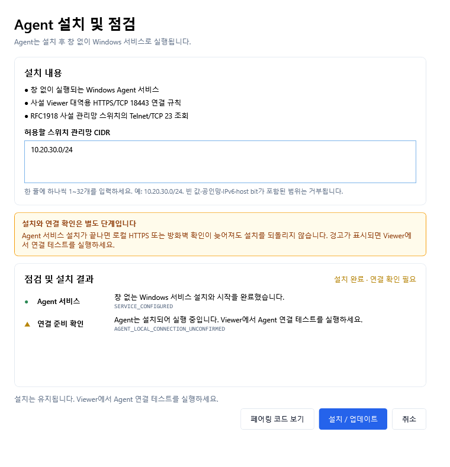
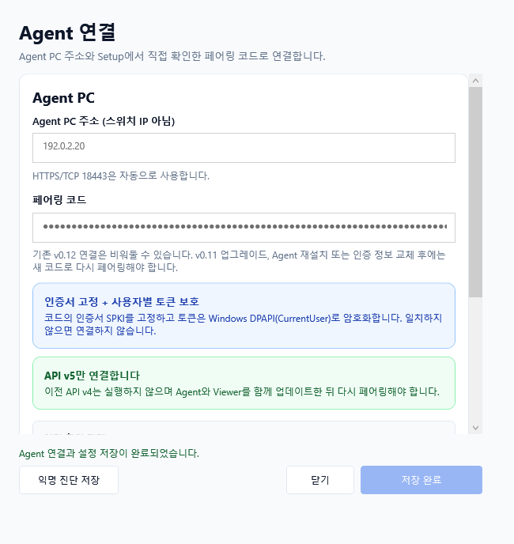
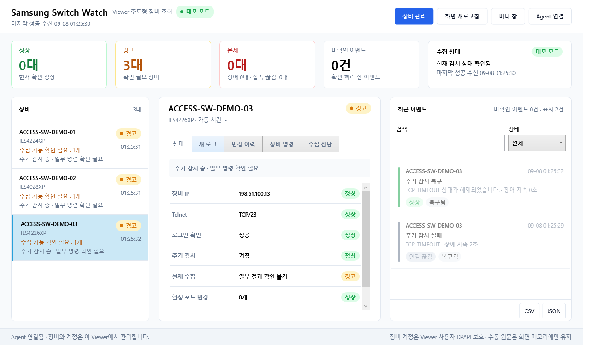
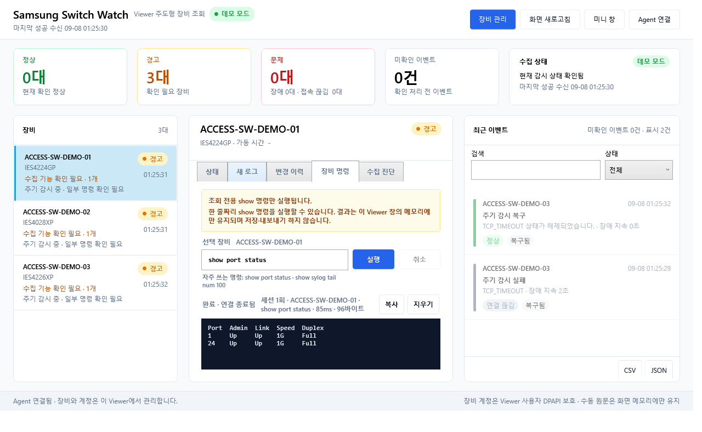
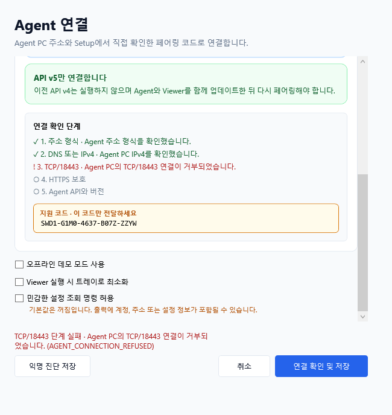

# 실제 창으로 보는 사용 흐름

아래 화면은 **0.13.0-poc의 실제 WPF 창**을 GitHub Actions Windows runner에서 렌더링했습니다. 장비명·주소·계정·명령 응답·설치/연결 성공·실패 상태는 모두 문서용 합성 입력입니다. 실제 스위치 접속, Agent 서비스 설치, 운영 계정 로그인은 수행하지 않았습니다.

## 1. Agent 설치와 관리망 확인



- **행동:** 실제 설치 시 허용할 스위치 관리망 CIDR을 확인하고 `설치 / 업데이트`를 실행합니다. 빈 값·공인 주소·IPv6·host bit가 포함된 CIDR은 거부됩니다.
- **읽을 값:** 예시 `10.20.30.0/24`는 합성 관리 VLAN입니다. `설치 완료 · 연결 확인 필요`는 설치와 Viewer 연결 확인이 서로 다른 단계임을 보여 줍니다.
- **다음 행동:** 설치가 끝나면 `페어링 코드 보기`에서 SSW1 코드를 확인해 Viewer에 직접 전달합니다. 코드는 인증 token이 포함된 비밀이므로 사진·로그·이슈에 올리지 않습니다. 이 캡처에는 코드 원문이 없습니다.

## 2. Viewer와 Agent 페어링



- **행동:** 스위치 주소가 아닌 **Agent PC 주소**와 Setup에서 얻은 페어링 코드를 입력하고 `연결 확인 및 저장`을 누릅니다.
- **읽을 값:** HTTPS/TCP 18443, 인증서 SPKI 고정, 사용자별 DPAPI token 보호, `API v5만 연결합니다` 안내를 확인합니다. 코드 필드는 마스킹된 공개 fixture이며 어떤 실제 Agent에서도 쓸 수 없습니다.
- **주의:** 그림의 `저장 완료`는 fake probe가 전달한 합성 연결 결과입니다. 실제 인증서·방화벽·서비스와 통신했다는 증거가 아닙니다. 기존 API v4는 계속 사용하지 않으며 Agent/Viewer를 같은 Release로 맞춰 재페어링합니다.
- **다음 행동:** 정상 연결 후 `장비 관리`에서 권한 있는 대상과 계정을 등록하고 로그인/모델 확인 → 저장 → 주기 감시 순서로 진행합니다. [장비 관리 화면](manual/images/03-device-management.png)도 합성 입력입니다.

## 3. 상태에서 명령 근거로 이동



- **행동:** 왼쪽 장비 → 가운데 상태/새 로그/변경 이력 → 오른쪽 최근 이벤트 순서로 봅니다. Viewer를 종료하면 주기 감시는 중단됩니다.
- **읽을 값:** 예시는 경고 3대와 `일부 결과 확인 불가`를 표시합니다. 개별 연결 항목의 녹색 정상 표시만 보고 전체 수집이 정상이라고 결론 내리지 않습니다. 수신 시각과 실패·복구 이벤트를 함께 확인합니다.
- **다음 행동:** 필요한 경우 `장비 명령`에서 허용된 한 줄짜리 `show` 명령으로 관측 근거를 확인합니다.



여기서는 `show port status`를 실행한 실제 UI가 합성 96-byte 응답을 표시합니다. `완료 · 연결 종료됨`과 읽기 전용 범위를 함께 확인합니다. 원문은 창 메모리에만 남고 자동 저장하지 않습니다. 민감 조회는 별도 허용이 필요하며, [보안 경계](SECURITY.md)를 먼저 확인합니다.

## 실패와 복구 화면



이 그림은 연결 창의 아래쪽을 스크롤한 모습입니다. 주소·DNS 단계 이후 **TCP/18443에서 실패**했으므로 아직 수행하지 않은 HTTPS/API 검증을 성공으로 해석하지 않습니다. `AGENT_CONNECTION_REFUSED`와 SWD1 지원 코드, `익명 진단 저장`을 확인한 뒤 해당 단계부터 점검합니다. 이 실패도 fake probe로 재현했습니다.

[Agent 복구 실패](manual/images/00-agent-setup-recovery-failed.png)와 [Viewer 복구 실패](manual/images/00-viewer-setup-failed.png)는 설치 잠금·복구 재시도·지원 코드 안내를 보여 줍니다. 캡처를 위해 실제 설치/제거를 실행하지 않았습니다. 전체 창과 조작 절차는 [PDF 매뉴얼](SamsungSwitchWatch_User_Manual_KO.pdf)에 있습니다.

## 캡처 출처와 재현

- 제품 버전: `0.13.0-poc`.
- 도구: [ManualCapture Program.cs](../tools/SamsungSwitchWatch.ManualCapture/Program.cs). 실제 창을 원래 data context와 함께 WPF RenderTargetBitmap으로 촬영합니다. Windows 작업영역에 따라 일부 창에는 스크롤이 필요합니다.
- 입력: RFC 5737 문서용 장비·Agent 주소와 합성 관리 CIDR, 메모리 fake client/probe, 임시 settings/device/monitor stores. native 설치 버튼·네트워크 장비 접속은 실행하지 않습니다.
- 캡처 source SHA·Windows OS·실행 URL·11개 PNG SHA-256: [capture-manifest.json](manual/images/capture-manifest.json). README의 `dashboard.png`와 `command-output.png`는 각각 manifest의 `01-dashboard.png`, `04-command-output.png`와 같은 파일입니다.
- 화면의 시각·경과시간은 합성 이벤트를 현재 렌더 시각에 표시한 값이며 실제 사건 이력이나 장기 운용 실적이 아닙니다. PNG 저장 commit은 캡처 source commit 이후에 생성됩니다.

Windows PowerShell, 저장소 루트와 .NET SDK **10.0.302** 기준:

```powershell
dotnet restore tools/SamsungSwitchWatch.ManualCapture/SamsungSwitchWatch.ManualCapture.csproj --locked-mode
dotnet build tools/SamsungSwitchWatch.ManualCapture/SamsungSwitchWatch.ManualCapture.csproj -c Release --no-restore
dotnet run --project tools/SamsungSwitchWatch.ManualCapture/SamsungSwitchWatch.ManualCapture.csproj -c Release --no-build --no-restore -- artifacts/manual-images
```

[Windows 캡처 workflow](../.github/workflows/docs-screenshots.yml)는 이미지를 artifact로 보관합니다. 기본 인수 없는 실행은 preview이므로 위처럼 출력 폴더를 넘깁니다. macOS는 WPF 실행 근거를 만들 수 없으며, Windows artifact와 이 문서의 PNG/PDF를 검토하는 경로를 사용합니다.

동일 이미지로 DOCX 생성:

```powershell
python tools/build-user-manual.py --output docs/SamsungSwitchWatch_User_Manual_KO.docx --images docs/manual/images
```

`python-docx`는 문서 작성 환경에만 필요합니다. DOCX는 Noto Sans KR 글꼴을 지정합니다. PDF 변환 환경에는 한국어 글꼴이 필요하며, 이번 PDF는 Noto Sans CJK KR 대체 글꼴을 사용했습니다. PDF로 변환한 뒤 모든 페이지의 이미지·보안 설명·글자 잘림을 다시 확인하고 커밋합니다. [문서 렌더 출처](manual/render-provenance.json)에 DOCX/PDF 해시와 전체 페이지 검토 기록을 남겼습니다. 현재 Windows 캡처 성공은 실제 설치/드라이버/GPO/스위치 펌웨어 호환성 검증과 구별합니다.
